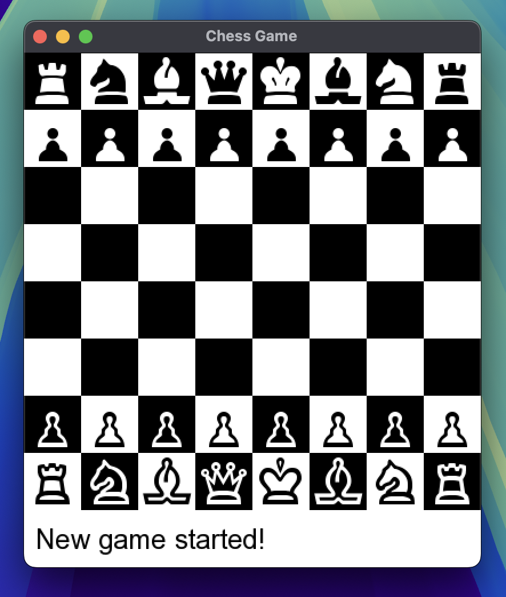

# Chess Game Project

## Overview

This project is a C++ implementation of a chess game with both graphical and console-based interfaces. The game supports human players and AI opponents of varying difficulty levels. It includes functionalities such as move validation, special moves (like castling and pawn promotion), and game state checking (check, checkmate, stalemate).

## Features

- **Graphical Display**: Utilizes SFML to render the chessboard and pieces.
- **Console Display**: Outputs the chessboard state and status messages to the console.
- **Human Player Support**: Allows two human players to play against each other.
- **AI Player Support**: Includes multiple levels of AI difficulty:
  - **Level 1**: Random legal moves.
  - **Level 2**: Prefers capturing moves and checks.
  - **Level 3**: Prefers avoiding capture, capturing moves, and checks.
  - **Level 4**: Uses a weighted random selection based on move scores for increased difficulty and randomness.
- **Special Moves**: Supports castling and pawn promotion.
- **Game State Checking**: Identifies check, checkmate, and stalemate conditions.

## Graphical Display Preview



## Example Console Output

```plaintext
Enter command: game human human
New game started between Human (White) and Human (Black).
8 ♜ ♞ ♝ ♛ ♚ ♝ ♞ ♜ 
7 ♟ ♟ ♟ ♟ ♟ ♟ ♟ ♟ 
6 . . . . . . . . 
5 . . . . . . . . 
4 . . . . . . . . 
3 . . . . . . . . 
2 ♙ ♙ ♙ ♙ ♙ ♙ ♙ ♙ 
1 ♖ ♘ ♗ ♕ ♔ ♗ ♘ ♖ 
  a b c d e f g h
```

## Prerequisites

- **C++ Compiler**: Ensure you have a C++14 compatible compiler installed.
- **Make**: Used for building the project.
- **SFML Development Libraries**: Required for graphical display.

### Installing Prerequisites on macOS

1. **Homebrew**: Install Homebrew if you haven't already.

   ```sh
   /bin/bash -c "$(curl -fsSL https://raw.githubusercontent.com/Homebrew/install/HEAD/install.sh)"
   ```

2. **SFML**: Install SFML to get the necessary libraries.

   ```sh
   brew install sfml@2
   ```

3. **Make**: Install Make.

   ```sh
   xcode-select --install
   ```

## Building the Project

1. **Clone the Repository**:

   ```sh
   git clone https://github.com/matteo-psnt/chess.git
   cd chess
   ```

2. **Build the Project**:

   ```sh
   make
   ```

## Running the Game

After building the project, run the executable:

```sh
./chess
```

## Project Structure

- **inc/**: Contains header files for various classes.
- **src/**: Contains implementation files for various classes.
- **build/**: Directory where the object files are generated.

## Classes and Key Files

- **main.cc**: Entry point for the application.
- **game.h / game.cc**: Manages the game flow and state.
- **board.h / board.cc**: Represents the chessboard and handles piece placement and movement.
- **pieces.h / pieces.cc**: Defines the different types of chess pieces and their movement logic.
- **player.h / player.cc**: Abstract class for players and derived classes for human and AI players.
- **gamemanager.h / gamemanager.cc**: Manages game initialization, player setup, and command processing.
- **display.h / display.cc**: Handles graphical display using SFML.
- **position.h**: Defines the Position struct used to represent coordinates on the board.
- **playeraction.h**: Defines the playerAction struct used to represent and score potential moves.

## Commands

The game accepts the following commands:

- **game [whitePlayerType] [blackPlayerType]**: Starts a new game with specified player types (human or computer[1-4]).
- **setup**: Enters setup mode to manually set up the board.
- **move [start_position] [end_position] [optional_promotion]**: Moves a piece from the start position to the end position. For pawn promotions, specify the promotion piece (e.g., move e7 e8 Q to promote to a queen).
- print: Displays the current state of the board in the console.

## Example Usage

1. **Start a New Game with Two Human Players**:

   ```sh
   game human human
   ```

2. **Start a New Game with a Human Player vs. Level 2 AI**:

   ```sh
   game human computer[2]
   ```

3. **Enter Setup Mode**:

   ```sh
   setup
   ```

4. **Move a Piece**:

   ```sh
   move a2 a4
   ```

5. **Pawn Promotion**:

   ```sh
   move a7 a8 Q
   ```

   > Default promotion is to queen if no piece type is specified.
